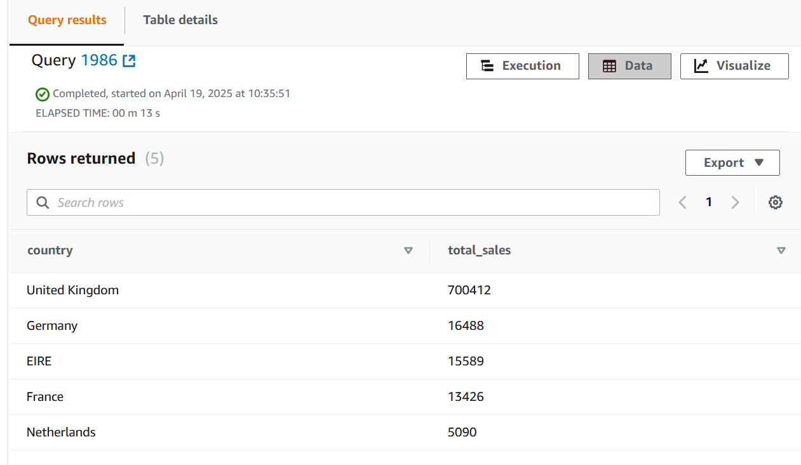

# E-Commerce Sales Data Warehouse on AWS

A cloud-based data warehouse pipeline to process, store, transform, and analyze e-commerce sales data using AWS S3, Glue, and Redshift. Built to demonstrate Cloud Data Engineering skills for ETL, cloud storage, and data warehousing.

## Overview
This project processes ~779,495 e-commerce sales records from the [Online Retail Dataset](https://www.kaggle.com/datasets/mashlyn/online-retail-ii-uci). It:
- Cleans and structures data locally with Python and MySQL.
- Stores raw data in AWS S3.
- Transforms data with AWS Glue (e.g., aggregates sales by product).
- Loads data into AWS Redshift for analytics.
- Runs SQL queries to derive insights (e.g., top-selling products).

## Architecture
```mermaid
graph TD
    A[Dataset<br>CSV] --> B[Python<br>process_data.py]
    B --> C[AWS S3<br>raw/]
    C --> D[AWS Glue<br>ecommerce-etl]
    D --> E[AWS S3<br>transformed/]
    C --> F[AWS Redshift<br>ecommerce]


Redshift screenshot

